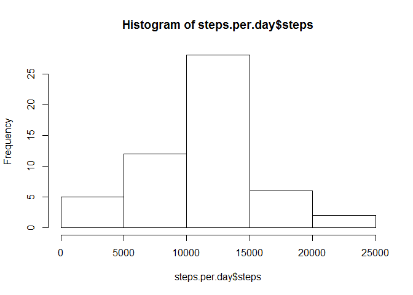
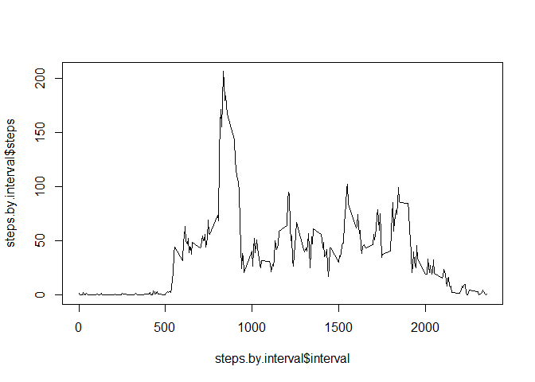
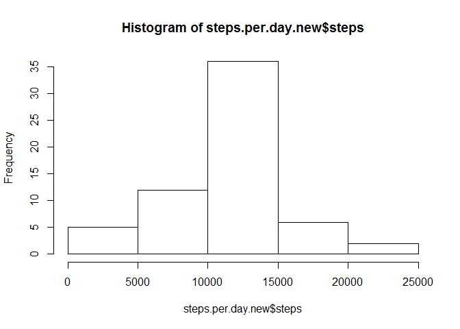
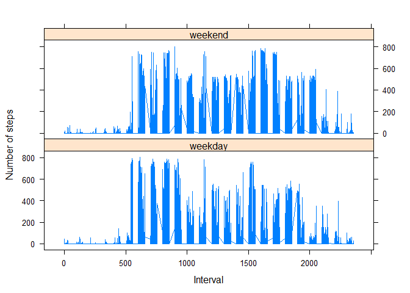

# Reproducible Research: Peer Assessment 1


## Loading and preprocessing the data
1 - Load and create the activity data

```r
activity = read.csv(unz("./activity.zip", "activity.csv"))
```

2 - Convert date into date format that is suitable for further analysis

```r
activity$date = as.Date(strptime(activity$date, "%Y-%m-%d"))
```

## What is mean total number of steps taken per day?
*Note: ignore the missing values*

1 - The total number of steps taken per day

```r
steps.per.day = aggregate(steps ~ date, data = activity, sum, na.rm=TRUE)
```

2 - Histogram of the total number of steps taken each day

```r
hist(steps.per.day$steps)
```

 

3 - Mean and median of the total number of steps taken per day

```r
mean(steps.per.day$steps)
```

```
## [1] 10766.19
```

```r
median(steps.per.day$steps)
```

```
## [1] 10765
```
## What is the average daily activity pattern?
1 - Time series plot of the 5-minute interval and the average number of steps taken, averaged across all days

```r
steps.by.interval = aggregate(steps ~ interval, data = activity, mean, na.rm=TRUE)
plot(steps.by.interval$steps ~ steps.by.interval$interval, type = "l")
```

 

2 - The 5-minute interval, on average across all the days in the dataset, contains the maximum number of steps

```r
steps.by.interval$interval[which.max(steps.by.interval$steps)]
```

```
## [1] 835
```

## Imputing missing values

1 - Total number of missing values in the dataset

```r
summary(activity)
```

```
##      steps             date               interval     
##  Min.   :  0.00   Min.   :2012-10-01   Min.   :   0.0  
##  1st Qu.:  0.00   1st Qu.:2012-10-16   1st Qu.: 588.8  
##  Median :  0.00   Median :2012-10-31   Median :1177.5  
##  Mean   : 37.38   Mean   :2012-10-31   Mean   :1177.5  
##  3rd Qu.: 12.00   3rd Qu.:2012-11-15   3rd Qu.:1766.2  
##  Max.   :806.00   Max.   :2012-11-30   Max.   :2355.0  
##  NA's   :2304
```

2 - Filling in the missing values of a particular date by using the mean for that 5-minute interval

```r
activity = merge(activity, steps.by.interval, by.x="interval", by.y="interval", all.x=TRUE, sort=FALSE)

for(i in which(is.na(activity$steps.x))) 
  activity$steps.x[i] = activity$steps.y[i]
```

3 - Create a new dataset that is equal to the original dataset but with the missing data filled in

```r
activity.new = data.frame("interval" = activity$interval, "steps" = activity$steps.x, "date" = activity$date)
```

4 - Histogram, mean, and median of the total number of steps taken each day

```r
steps.per.day.new = aggregate(steps ~ date, data = activity.new, sum, na.rm=TRUE)
hist(steps.per.day.new$steps)
```

 

```r
mean(steps.per.day.new$steps)
```

```
## [1] 10766.19
```

```r
median(steps.per.day.new$steps)
```

```
## [1] 10766.19
```
When comparing the original dataset (with missing values) and the new dataset (filled missing values), the mean are the same, the median are slightly different.

Imputing missing data can affect the estimates of the total daily number of steps in three ways: higher, lower, or the same. This depends on the strategy of divising the missing values. In our method, the estimates will stay the same.

## Are there differences in activity patterns between weekdays and weekends?
1 - New factor variable in the dataset with two levels - "weekday" and "weekend".

```r
weekday = weekdays(activity.new$date)

for(i in which(weekday == "Saturday" | weekday == "Sunday"))
  activity.new$weekday[i] = "weekend"

for (i in which(is.na(activity.new$weekday)))
  activity.new$weekday[i] = "weekday"

activity.new$weekday = factor(activity.new$weekday)
```

2 - Panel plot containing a time series plot of the 5-minute interval and the average number of steps taken, averaged across all weekday days or weekend days.

The lattice plotting system is used.

```r
library(lattice)
xyplot(steps ~ interval | weekday, data = activity.new, layout = c(1,2), type = "l",
       xlab = "Interval", ylab = "Number of steps")
```

 
